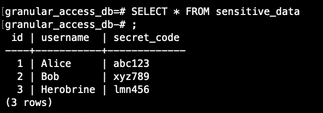
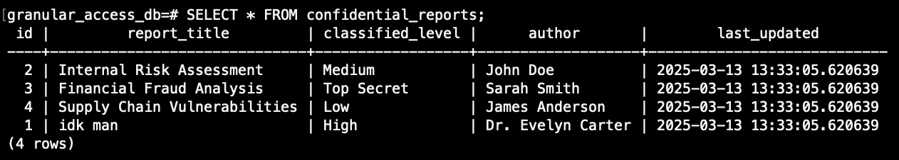
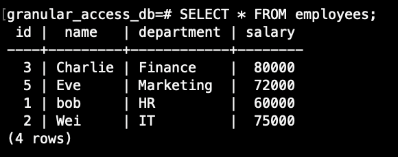
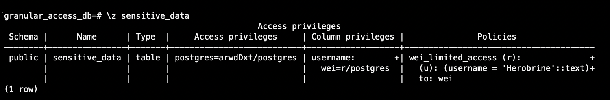
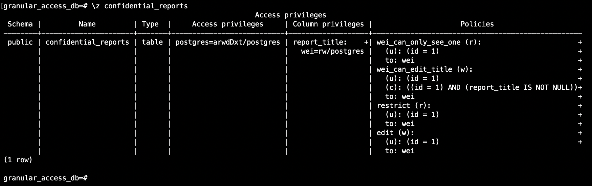
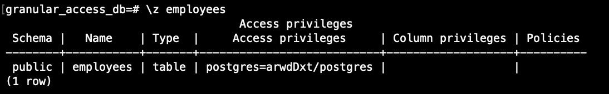

# Granulær Adgangskontrol med PostgreSQL

Databasen **granular_access_db** er eksponeret via Pinggy og anvender **Row-Level Security** og kolonne-begrænsninger for selektiv adgang.

**Tabeller:**
• **sensitive_data**
• **confidential_reports**

**Brugere:**
• **postgres** – Admin med fuld adgang
• **wei** – Begrænset bruger med meget specifik adgang


## Tabellerne
### sensitive_data: 


### confidential_reports: 


### employees:


## Adgangsbegrænsninger
### sensitive_data begrænsninger: 


### confidential_reports begrænsninger: 


### employees begrænsninger


# Data og Struktur

### sensitive_data
• Indeholder følsomme brugeroplysninger.
• Kolonner: id, username, secret_code

### confidential_reports
• Bruges til rapporter med begrænset adgang.
• Kolonner: id, report_title, classified_level, author, last_updated

### employees
• Bruges til medarbejder info
• Kolonner: id, name, department, salary

## Installation af PostgreSQL Client (psql)

For at kunne oprette forbindelse til databasen, skal du have PostgreSQL’s CLI installeret.

### Windows:

• Hent installationsfilen fra: [enterprisedb.com/downloads](https://www.enterprisedb.com/downloads/postgres-postgresql-downloads)

• Vælg den nyeste version (f.eks. 17.4) under installationen

• Sørg for at “Command Line Tools” er markeret under “Select Components”

• Husk adgangskoden, du vælger under setup – den skal bruges ved login

###  macOS:
• Installer Homebrew hvis du ikke har det (besøg [brew.sh](https://brew.sh/))

• Åbn Terminal og kør:
```sh
brew install postgresql
```

### Linux 
• Åbn en terminal og kør:
```sh
sudo apt install postgresql
```


## Rettighedsopsætning

1. **Aktiver Row-Level Security**
	```sh
	ALTER TABLE sensitive_data ENABLE ROW LEVEL SECURITY;
    ```
2. **Fjern bred SELECT-adgang**
	```sh
	REVOKE SELECT ON sensitive_data FROM wei;
	```
3. **Tillad kun adgang til én kolonne**
	```sh
	GRANT SELECT (username) ON sensitive_data TO wei;
	```
4. **Opret politik for række-baseret adgang**
	```sh
	CREATE POLICY wei_limited_access
	ON sensitive_data
	FOR SELECT
	TO wei
	USING (username = 'Herobrine');
	```


# Reverse Tunnel og Forbindelse

1. Start tunnel:
	```sh
	pinggy --type tcp -R 0:localhost:5432
	```
2. Forbind med psql:
	```sh
	psql -U wei -h <pinggy-url> -p <port> -d granular_access_db
	```
3. Skriv kodeord: **mongo
	
# Commands til adgang:
```sh
SELECT * FROM employees;                              -- ingen adgang
SELECT username FROM sensitive_data;                  -- viser kun "Herobrine"

SELECT author FROM confidential_reports;              -- ingen adgang
SELECT report_title FROM confidential_reports;        -- tilladt
```

# Opsummering

Brugeren **wei** har _meget_ afgrænset adgang, både på kolonne- og række-niveau.

• Reverse tunnel gør det muligt at expose databasen til andre så de kan integrere med den. 

• RLS + GRANT giver præcis kontrol over hvem der ser hvad.